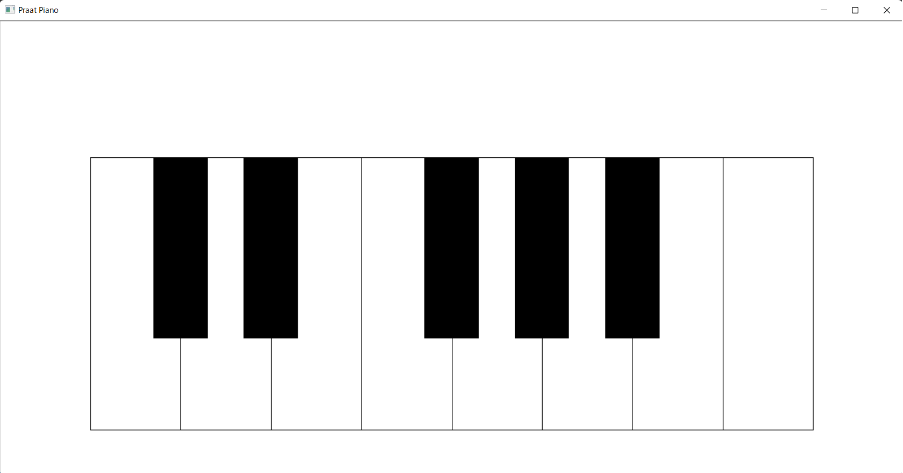

# praat_piano
Toy piano GUI working on Praat (just for fun!)

# usage

1. Open [Praat](https://www.fon.hum.uva.nl/praat/)
1. Open Praat Script `main.praat`
1. Run the script
1. Play the piano by clicking keyboards!

# version

runned on Praat `6.2.11`

# for developers

You can run all unit tests by `test.sh`.
